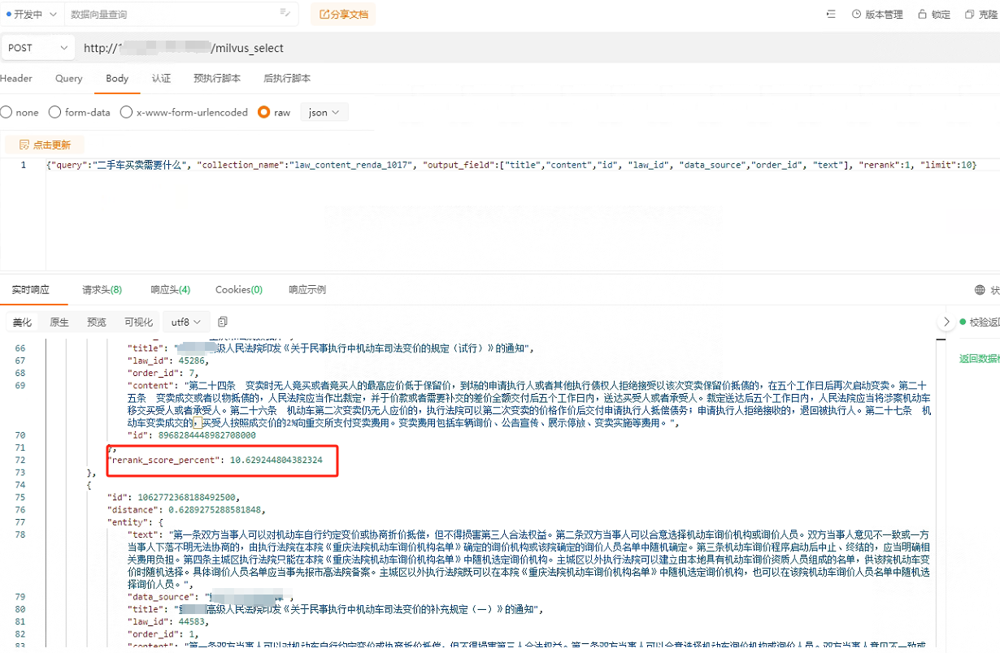
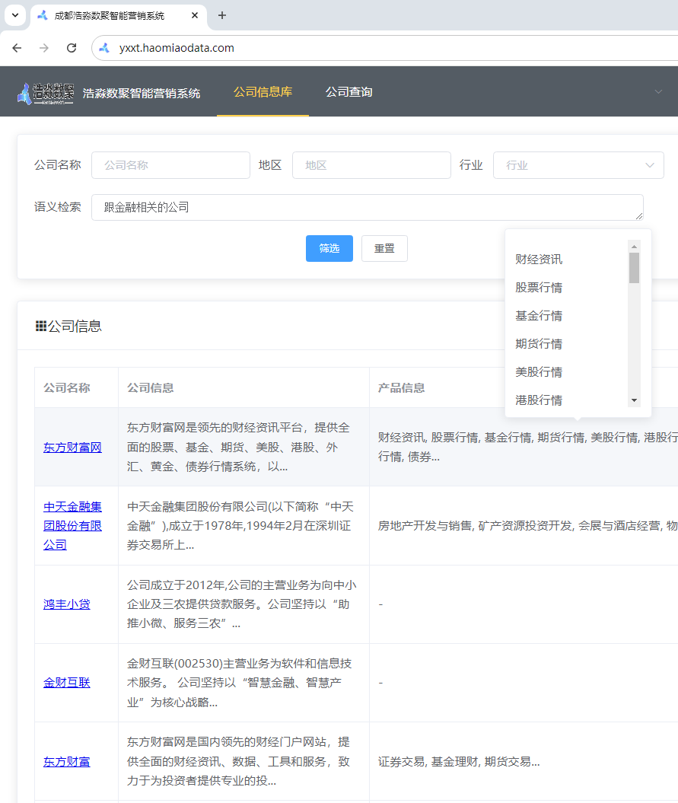

<p align="center">
  <a href="./README.md">简体中文</a> |
  <a href="./README_en.md">English</a> |
</p>

## 简介
本项目基于Milvus Lite和GTE向量模型，实现了一个超节省系统资源的语义检索开源方案。该方案支持通过Docker部署轻量级语义检索接口，仅需1GB内存即可运行，且支持本地数据存储与迁移。适合本地部署的知识库或者小规模的应用。

## 项目地址
https://github.com/BetaStreetOmnis/milvus_lite_server

## 部署方案概述
### 向量库
使用Milvus的轻量版Milvus Lite，支持高效存储与检索大规模向量数据，适用于硬件资源有限的场景。

### embedding model
用于文本向量化，将文本转换为固定长度的向量表示。我们基于`nlp_gte_sentence-embedding_chinese-base`模型，测试效果优于bge和m3e。

### rerank model
通过重排序机制优化查询结果精度，提升搜索相关性，基于`gte_passage-ranking_multilingual-base`模型。

## Docker部署与资源优化
### 部署环境要求
- 内存：最低1核1GB内存，支持CPU运行。
- 存储：支持本地存储并具备数据迁移能力。

### Docker容器配置
通过Docker容器进行部署能够保证应用轻量化，即使在资源受限的情况下，也能流畅运行。以下是Docker容器的基本设置步骤：

1. 克隆项目仓库：
```bash
git clone https://github.com/BetaStreetOmnis/milvus_lite_server
cd milvus_lite_server
```
2. 构建 Docker 镜像：
```bash
docker build -t milvus_lite_server:latest .
```
3. 运行 Docker 容器：
```bash
docker run -d -p 8089:8089 --name milvus_lite_api \
-v /path/to/your/db:/app/db milvus_lite_server
```
注意：请将 `/path/to/your/db` 替换为您希望存储数据库文件的实际路径。

## 功能介绍与代码示例
### 1. 向量数据写入Milvus数据库
在进行数据检索前，文本数据需经过向量化后写入Milvus数据库。可以通过API接口执行这一操作：
```python
def insert_milvus(collection_name, insert_data):
    url = "http://192.168.16.23:31556/milvus_insert/"
    payload = {"collection_name": collection_name, "insert_data": insert_data}
    headers = {"authorization": "20241010", "content-type": "application/json"}

    response = requests.post(url, json=payload, headers=headers)
    return response.text
```
### 2. 向量数据查询
为了实现高效查询，可以调用以下接口。若关闭Rerank功能（`"rerank": 0`），可节省计算资源，适合低资源环境：
```python
def query_milvus(query_text, collection_name, output_field, rerank=0, limit=10):
    url = "http://192.168.16.23:31556/milvus_select/"
    payload = {
        "query": query_text,
        "collection_name": collection_name,
        "output_field": output_field,
        "rerank": rerank,
        "limit": limit
    }
    headers = {"authorization": "20241010", "content-type": "application/json"}

    response = requests.post(url, json=payload, headers=headers)
    return response.text
```
### 3. 文本向量化
利用GTE提供的API接口，可以将文本转换为向量形式，支持单条和批量操作：
```python
# 单条文本向量化
def text_to_vector(text):
    url = "http://192.168.16.23:31556/vector/"
    payload = {"text": text}
    headers = {"authorization": "20241010", "content-type": "application/json"}

    response = requests.post(url, json=payload, headers=headers)
    return response.text

# 列表文本向量化
def batch_text_to_vectors(text_list):
    url = "http://192.168.16.23:31556/vectors/"
    payload = {"vector_list": text_list}
    headers = {"authorization": "20241010", "content-type": "application/json"}

    response = requests.post(url, json=payload, headers=headers)
    return response.text
```
## 效果
直接接口查询的效果，其中的rerank_score_percent是指查询的语句和搜索的结果的相似度，是基于二次重排序rerank计算的，可以保证计算的相似度更加的准确，当然计算速度也会慢些，关于rerank可以查看文章为什么需要rerank。



也可以用于直接前端查询，用于语义检索的功能中，效果如下：


## Rerank与OpenAI接口集成
在需要高精度查询时，Rerank功能可以进行查询结果的重排序，显著提升相关性。虽然开启Rerank会增加系统计算开销，但对于某些精度要求较高的场景非常有用。

此外，系统还支持通过OpenAI的Embedding接口进行文本向量化，能够无缝集成Dify等第三方平台，进一步提升易用性与扩展能力。

## 总结
在硬件资源有限的情况下，Milvus Lite结合基于阿里开源的gte embedding模型与Rerank模型，能够实现高效、轻量的向量化解决方案，1GB内存即可运行，且支持Docker部署与本地存储。通过灵活的数据迁移机制，开发者可以在不同环境间迁移数据。该方案还支持与OpenAI embedding接口集成，提升整体系统的智能化与扩展能力。

